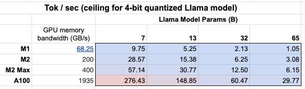

# 로컬에서 모델 실행하기

## 사용 사례

[llama.cpp](https://github.com/ggerganov/llama.cpp), [Ollama](https://github.com/ollama/ollama), [GPT4All](https://github.com/nomic-ai/gpt4all), [llamafile](https://github.com/Mozilla-Ocho/llamafile)와 같은 프로젝트의 인기는 LLM을 로컬(자신의 장치)에서 실행하려는 수요를 강조합니다.

이는 최소한 두 가지 중요한 이점을 제공합니다:

1. `프라이버시`: 귀하의 데이터가 제3자에게 전송되지 않으며, 상업 서비스의 서비스 약관에 적용되지 않습니다.
2. `비용`: 추론 수수료가 없으며, 이는 토큰 집약적인 애플리케이션(예: [장기 실행 시뮬레이션](https://twitter.com/RLanceMartin/status/1691097659262820352?s=20), 요약)에 중요합니다.

## 개요

로컬에서 LLM을 실행하려면 몇 가지가 필요합니다:

1. `오픈 소스 LLM`: 자유롭게 수정하고 공유할 수 있는 오픈 소스 LLM
2. `추론`: 허용 가능한 지연 시간으로 이 LLM을 귀하의 장치에서 실행할 수 있는 능력

### 오픈 소스 LLMs

사용자는 이제 빠르게 성장하는 [오픈 소스 LLMs](https://cameronrwolfe.substack.com/p/the-history-of-open-source-llms-better)에 접근할 수 있습니다.

이 LLM은 최소한 두 가지 차원에서 평가할 수 있습니다(그림 참조):

1. `기본 모델`: 기본 모델은 무엇이며 어떻게 훈련되었나요?
2. `미세 조정 접근법`: 기본 모델이 미세 조정되었는지, 그렇다면 어떤 [지침 세트](https://cameronrwolfe.substack.com/p/beyond-llama-the-power-of-open-llms#%C2%A7alpaca-an-instruction-following-llama-model)가 사용되었나요?


이 모델들의 상대적인 성능은 다음과 같은 여러 리더보드를 사용하여 평가할 수 있습니다:

1. [LmSys](https://chat.lmsys.org/?arena)
2. [GPT4All](https://gpt4all.io/index.html)
3. [HuggingFace](https://huggingface.co/spaces/lmsys/chatbot-arena-leaderboard)

### 추론

이것을 지원하기 위해 몇 가지 프레임워크가 등장하여 다양한 장치에서 오픈 소스 LLM의 추론을 지원합니다:

1. [`llama.cpp`](https://github.com/ggerganov/llama.cpp): [가중치 최적화 / 양자화](https://finbarr.ca/how-is-llama-cpp-possible/)가 포함된 C++ 구현
2. [`gpt4all`](https://docs.gpt4all.io/index.html): 추론을 위한 최적화된 C 백엔드
3. [`Ollama`](https://ollama.ai/): 모델 가중치와 환경을 장치에서 실행되고 LLM을 제공하는 앱으로 묶음
4. [`llamafile`](https://github.com/Mozilla-Ocho/llamafile): 모델 가중치와 모델 실행에 필요한 모든 것을 단일 파일로 묶어 추가 설치 단계 없이 이 파일에서 LLM을 로컬에서 실행할 수 있도록 함

일반적으로 이러한 프레임워크는 몇 가지 작업을 수행합니다:

1. `양자화`: 원시 모델 가중치의 메모리 사용량을 줄입니다.
2. `추론을 위한 효율적인 구현`: 소비자 하드웨어에서 추론을 지원합니다(예: CPU 또는 노트북 GPU).

특히, 양자화의 중요성에 대한 [이 훌륭한 게시물](https://finbarr.ca/how-is-llama-cpp-possible/)을 참조하십시오.


정확도가 낮아지면 LLM을 메모리에 저장하는 데 필요한 메모리를 급격히 줄일 수 있습니다.

또한, GPU 메모리 대역폭의 중요성을 [시트](https://docs.google.com/spreadsheets/d/1OehfHHNSn66BP2h3Bxp2NJTVX97icU0GmCXF6pK23H8/edit#gid=0)에서 확인할 수 있습니다!

Mac M2 Max는 더 큰 GPU 메모리 대역폭 덕분에 M1보다 5-6배 빠릅니다.



### 프롬프트 형식화

일부 제공자는 특정 로컬 모델에 대한 입력 프롬프트 형식을 처리하는 [채팅 모델](/docs/concepts/#chat-models) 래퍼를 제공합니다. 그러나 텍스트 입력/출력 LLM 래퍼로 로컬 모델에 프롬프트를 제공하는 경우 특정 모델에 맞춘 프롬프트를 사용해야 할 수 있습니다.

이것은 [특수 토큰의 포함](https://huggingface.co/blog/llama2#how-to-prompt-llama-2)을 요구할 수 있습니다. [여기 LLaMA 2에 대한 예시가 있습니다](https://smith.langchain.com/hub/rlm/rag-prompt-llama).

## 빠른 시작

[`Ollama`](https://ollama.ai/)는 macOS에서 추론을 쉽게 실행하는 방법 중 하나입니다.

[여기](https://github.com/jmorganca/ollama?tab=readme-ov-file#ollama) 제공된 지침은 세부 정보를 제공하며, 우리는 요약합니다:

* [앱 다운로드 및 실행](https://ollama.ai/download)
* 명령줄에서 이 [옵션 목록](https://github.com/jmorganca/ollama)에서 모델을 가져옵니다: 예: `ollama pull llama3.1:8b`
* 앱이 실행 중일 때 모든 모델이 `localhost:11434`에서 자동으로 제공됩니다.

```python
%pip install -qU langchain_ollama
```


```python
<!--IMPORTS:[{"imported": "OllamaLLM", "source": "langchain_ollama", "docs": "https://api.python.langchain.com/en/latest/llms/langchain_ollama.llms.OllamaLLM.html", "title": "Run models locally"}]-->
from langchain_ollama import OllamaLLM

llm = OllamaLLM(model="llama3.1:8b")

llm.invoke("The first man on the moon was ...")
```


```output
'...Neil Armstrong!\n\nOn July 20, 1969, Neil Armstrong became the first person to set foot on the lunar surface, famously declaring "That\'s one small step for man, one giant leap for mankind" as he stepped off the lunar module Eagle onto the Moon\'s surface.\n\nWould you like to know more about the Apollo 11 mission or Neil Armstrong\'s achievements?'
```


생성되는 대로 토큰 스트리밍:

```python
for chunk in llm.stream("The first man on the moon was ..."):
    print(chunk, end="|", flush=True)
```

```output
...|
``````output
Neil| Armstrong|,| an| American| astronaut|.| He| stepped| out| of| the| lunar| module| Eagle| and| onto| the| surface| of| the| Moon| on| July| |20|,| |196|9|,| famously| declaring|:| "|That|'s| one| small| step| for| man|,| one| giant| leap| for| mankind|."||
```

Ollama는 대화 턴 형식을 처리하는 채팅 모델 래퍼도 포함합니다:

```python
<!--IMPORTS:[{"imported": "ChatOllama", "source": "langchain_ollama", "docs": "https://api.python.langchain.com/en/latest/chat_models/langchain_ollama.chat_models.ChatOllama.html", "title": "Run models locally"}]-->
from langchain_ollama import ChatOllama

chat_model = ChatOllama(model="llama3.1:8b")

chat_model.invoke("Who was the first man on the moon?")
```


```output
AIMessage(content='The answer is a historic one!\n\nThe first man to walk on the Moon was Neil Armstrong, an American astronaut and commander of the Apollo 11 mission. On July 20, 1969, Armstrong stepped out of the lunar module Eagle onto the surface of the Moon, famously declaring:\n\n"That\'s one small step for man, one giant leap for mankind."\n\nArmstrong was followed by fellow astronaut Edwin "Buzz" Aldrin, who also walked on the Moon during the mission. Michael Collins remained in orbit around the Moon in the command module Columbia.\n\nNeil Armstrong passed away on August 25, 2012, but his legacy as a pioneering astronaut and engineer continues to inspire people around the world!', response_metadata={'model': 'llama3.1:8b', 'created_at': '2024-08-01T00:38:29.176717Z', 'message': {'role': 'assistant', 'content': ''}, 'done_reason': 'stop', 'done': True, 'total_duration': 10681861417, 'load_duration': 34270292, 'prompt_eval_count': 19, 'prompt_eval_duration': 6209448000, 'eval_count': 141, 'eval_duration': 4432022000}, id='run-7bed57c5-7f54-4092-912c-ae49073dcd48-0', usage_metadata={'input_tokens': 19, 'output_tokens': 141, 'total_tokens': 160})
```


## 환경

로컬에서 모델을 실행할 때 추론 속도가 도전 과제가 됩니다(위 참조).

지연 시간을 최소화하기 위해 GPU에서 로컬 모델을 실행하는 것이 바람직하며, 이는 많은 소비자 노트북에 탑재되어 있습니다 [예: Apple 장치](https://www.apple.com/newsroom/2022/06/apple-unveils-m2-with-breakthrough-performance-and-capabilities/) .

GPU가 있더라도, 사용 가능한 GPU 메모리 대역폭(위에서 언급한 대로)이 중요합니다.

### Apple 실리콘 GPU 실행

`Ollama`와 [`llamafile`](https://github.com/Mozilla-Ocho/llamafile?tab=readme-ov-file#gpu-support)는 Apple 장치에서 GPU를 자동으로 활용합니다.

다른 프레임워크는 사용자가 Apple GPU를 활용하기 위해 환경을 설정해야 합니다.

예를 들어, `llama.cpp` 파이썬 바인딩은 [Metal](https://developer.apple.com/metal/)을 통해 GPU를 사용하도록 구성할 수 있습니다.

Metal은 Apple이 만든 그래픽 및 컴퓨팅 API로, GPU에 거의 직접 접근할 수 있습니다.

이 설정을 활성화하려면 [`llama.cpp`](docs/integrations/llms/llamacpp) [여기](https://github.com/abetlen/llama-cpp-python/blob/main/docs/install/macos.md)를 참조하십시오.

특히, conda가 생성한 올바른 가상 환경(`miniforge3`)을 사용하고 있는지 확인하십시오.

예를 들어, 저의 경우:

```
conda activate /Users/rlm/miniforge3/envs/llama
```


위의 확인이 완료되면:

```
CMAKE_ARGS="-DLLAMA_METAL=on" FORCE_CMAKE=1 pip install -U llama-cpp-python --no-cache-dir
```


## LLMs

양자화된 모델 가중치에 접근하는 다양한 방법이 있습니다.

1. [`HuggingFace`](https://huggingface.co/TheBloke) - 많은 양자화된 모델이 다운로드 가능하며 [`llama.cpp`](https://github.com/ggerganov/llama.cpp)와 같은 프레임워크로 실행할 수 있습니다. 또한 HuggingFace에서 [`llamafile` 형식](https://huggingface.co/models?other=llamafile)으로 모델을 다운로드할 수 있습니다.
2. [`gpt4all`](https://gpt4all.io/index.html) - 모델 탐색기는 다운로드 가능한 메트릭 및 관련 양자화된 모델의 리더보드를 제공합니다.
3. [`Ollama`](https://github.com/jmorganca/ollama) - 여러 모델을 `pull`을 통해 직접 접근할 수 있습니다.

### Ollama

[Ollama](https://github.com/jmorganca/ollama)를 사용하여 `ollama pull <모델 패밀리>:<태그>`를 통해 모델을 가져옵니다:

* 예: Llama 2 7b의 경우: `ollama pull llama2`는 모델의 가장 기본 버전(예: 가장 작은 매개변수 수 및 4비트 양자화)을 다운로드합니다.
* 또한 [모델 목록](https://github.com/jmorganca/ollama?tab=readme-ov-file#model-library)에서 특정 버전을 지정할 수 있습니다. 예: `ollama pull llama2:13b`
* 관심 있는 매개변수를 설정하기 위해 [API 참조 페이지](https://api.python.langchain.com/en/latest/llms/langchain_community.llms.ollama.Ollama.html)에서 전체 매개변수 세트를 확인하십시오.

```python
llm = OllamaLLM(model="llama2:13b")
llm.invoke("The first man on the moon was ... think step by step")
```


```output
' Sure! Here\'s the answer, broken down step by step:\n\nThe first man on the moon was... Neil Armstrong.\n\nHere\'s how I arrived at that answer:\n\n1. The first manned mission to land on the moon was Apollo 11.\n2. The mission included three astronauts: Neil Armstrong, Edwin "Buzz" Aldrin, and Michael Collins.\n3. Neil Armstrong was the mission commander and the first person to set foot on the moon.\n4. On July 20, 1969, Armstrong stepped out of the lunar module Eagle and onto the moon\'s surface, famously declaring "That\'s one small step for man, one giant leap for mankind."\n\nSo, the first man on the moon was Neil Armstrong!'
```


### Llama.cpp

Llama.cpp는 [광범위한 모델 세트](https://github.com/ggerganov/llama.cpp)와 호환됩니다.

예를 들어, 아래에서는 [HuggingFace](https://huggingface.co/TheBloke/Llama-2-13B-GGML/tree/main)에서 다운로드한 4비트 양자화된 `llama2-13b`에 대해 추론을 실행합니다.

위에서 언급한 대로, 전체 매개변수 세트를 보려면 [API 참조](https://api.python.langchain.com/en/latest/llms/langchain.llms.llamacpp.LlamaCpp.html?highlight=llamacpp#langchain.llms.llamacpp.LlamaCpp)를 참조하십시오.

[llama.cpp API 참조 문서](https://api.python.langchain.com/en/latest/llms/langchain_community.llms.llamacpp.LlamaCpp.htm)에서 몇 가지는 주목할 가치가 있습니다:

`n_gpu_layers`: GPU 메모리에 로드할 레이어 수

* 값: 1
* 의미: 모델의 한 레이어만 GPU 메모리에 로드됩니다(1은 종종 충분합니다).

`n_batch`: 모델이 병렬로 처리해야 할 토큰 수

* 값: n_batch
* 의미: 1과 n_ctx(이 경우 2048로 설정됨) 사이의 값을 선택하는 것이 좋습니다.

`n_ctx`: 토큰 컨텍스트 창

* 값: 2048
* 의미: 모델은 한 번에 2048개의 토큰 창을 고려합니다.

`f16_kv`: 모델이 키/값 캐시에 대해 반정밀도를 사용해야 하는지 여부

* 값: True
* 의미: 모델은 반정밀도를 사용하며, 이는 메모리 효율성이 더 높을 수 있습니다; Metal은 True만 지원합니다.

```python
%env CMAKE_ARGS="-DLLAMA_METAL=on"
%env FORCE_CMAKE=1
%pip install --upgrade --quiet  llama-cpp-python --no-cache-dirclear
```


```python
<!--IMPORTS:[{"imported": "LlamaCpp", "source": "langchain_community.llms", "docs": "https://api.python.langchain.com/en/latest/llms/langchain_community.llms.llamacpp.LlamaCpp.html", "title": "Run models locally"}, {"imported": "CallbackManager", "source": "langchain_core.callbacks", "docs": "https://api.python.langchain.com/en/latest/callbacks/langchain_core.callbacks.manager.CallbackManager.html", "title": "Run models locally"}, {"imported": "StreamingStdOutCallbackHandler", "source": "langchain_core.callbacks", "docs": "https://api.python.langchain.com/en/latest/callbacks/langchain_core.callbacks.streaming_stdout.StreamingStdOutCallbackHandler.html", "title": "Run models locally"}]-->
from langchain_community.llms import LlamaCpp
from langchain_core.callbacks import CallbackManager, StreamingStdOutCallbackHandler

llm = LlamaCpp(
    model_path="/Users/rlm/Desktop/Code/llama.cpp/models/openorca-platypus2-13b.gguf.q4_0.bin",
    n_gpu_layers=1,
    n_batch=512,
    n_ctx=2048,
    f16_kv=True,
    callback_manager=CallbackManager([StreamingStdOutCallbackHandler()]),
    verbose=True,
)
```


콘솔 로그는 위 단계에서 Metal이 올바르게 활성화되었음을 나타내기 위해 아래와 같이 표시됩니다:
```
ggml_metal_init: allocating
ggml_metal_init: using MPS
```


```python
llm.invoke("The first man on the moon was ... Let's think step by step")
```

```output
Llama.generate: prefix-match hit
``````output
 and use logical reasoning to figure out who the first man on the moon was.

Here are some clues:

1. The first man on the moon was an American.
2. He was part of the Apollo 11 mission.
3. He stepped out of the lunar module and became the first person to set foot on the moon's surface.
4. His last name is Armstrong.

Now, let's use our reasoning skills to figure out who the first man on the moon was. Based on clue #1, we know that the first man on the moon was an American. Clue #2 tells us that he was part of the Apollo 11 mission. Clue #3 reveals that he was the first person to set foot on the moon's surface. And finally, clue #4 gives us his last name: Armstrong.
Therefore, the first man on the moon was Neil Armstrong!
``````output

llama_print_timings:        load time =  9623.21 ms
llama_print_timings:      sample time =   143.77 ms /   203 runs   (    0.71 ms per token,  1412.01 tokens per second)
llama_print_timings: prompt eval time =   485.94 ms /     7 tokens (   69.42 ms per token,    14.40 tokens per second)
llama_print_timings:        eval time =  6385.16 ms /   202 runs   (   31.61 ms per token,    31.64 tokens per second)
llama_print_timings:       total time =  7279.28 ms
```


```output
" and use logical reasoning to figure out who the first man on the moon was.\n\nHere are some clues:\n\n1. The first man on the moon was an American.\n2. He was part of the Apollo 11 mission.\n3. He stepped out of the lunar module and became the first person to set foot on the moon's surface.\n4. His last name is Armstrong.\n\nNow, let's use our reasoning skills to figure out who the first man on the moon was. Based on clue #1, we know that the first man on the moon was an American. Clue #2 tells us that he was part of the Apollo 11 mission. Clue #3 reveals that he was the first person to set foot on the moon's surface. And finally, clue #4 gives us his last name: Armstrong.\nTherefore, the first man on the moon was Neil Armstrong!"
```


### GPT4All

우리는 [GPT4All](/docs/integrations/llms/gpt4all) 모델 탐색기에서 다운로드한 모델 가중치를 사용할 수 있습니다.

위에서 보여준 것과 유사하게, 우리는 추론을 실행하고 [API 참조](https://api.python.langchain.com/en/latest/llms/langchain_community.llms.gpt4all.GPT4All.html)를 사용하여 관심 있는 매개변수를 설정할 수 있습니다.

```python
%pip install gpt4all
```


```python
<!--IMPORTS:[{"imported": "GPT4All", "source": "langchain_community.llms", "docs": "https://api.python.langchain.com/en/latest/llms/langchain_community.llms.gpt4all.GPT4All.html", "title": "Run models locally"}]-->
from langchain_community.llms import GPT4All

llm = GPT4All(
    model="/Users/rlm/Desktop/Code/gpt4all/models/nous-hermes-13b.ggmlv3.q4_0.bin"
)
```


```python
llm.invoke("The first man on the moon was ... Let's think step by step")
```


```output
".\n1) The United States decides to send a manned mission to the moon.2) They choose their best astronauts and train them for this specific mission.3) They build a spacecraft that can take humans to the moon, called the Lunar Module (LM).4) They also create a larger spacecraft, called the Saturn V rocket, which will launch both the LM and the Command Service Module (CSM), which will carry the astronauts into orbit.5) The mission is planned down to the smallest detail: from the trajectory of the rockets to the exact movements of the astronauts during their moon landing.6) On July 16, 1969, the Saturn V rocket launches from Kennedy Space Center in Florida, carrying the Apollo 11 mission crew into space.7) After one and a half orbits around the Earth, the LM separates from the CSM and begins its descent to the moon's surface.8) On July 20, 1969, at 2:56 pm EDT (GMT-4), Neil Armstrong becomes the first man on the moon. He speaks these"
```


### llamafile

LLM을 로컬에서 실행하는 가장 간단한 방법 중 하나는 [llamafile](https://github.com/Mozilla-Ocho/llamafile)를 사용하는 것입니다. 필요한 것은 다음과 같습니다:

1. [HuggingFace](https://huggingface.co/models?other=llamafile)에서 llamafile 다운로드
2. 파일을 실행 가능하게 만들기
3. 파일 실행

llamafile은 모델 가중치와 [`llama.cpp`](https://github.com/ggerganov/llama.cpp)의 [특별히 컴파일된](https://github.com/Mozilla-Ocho/llamafile?tab=readme-ov-file#technical-details) 버전을 단일 파일로 묶어 추가 종속성 없이 대부분의 컴퓨터에서 실행할 수 있도록 합니다. 또한 모델과 상호작용하기 위한 [API](https://github.com/Mozilla-Ocho/llamafile/blob/main/llama.cpp/server/README.md#api-endpoints)를 제공하는 내장 추론 서버가 함께 제공됩니다.

다음은 모든 3가지 설정 단계를 보여주는 간단한 bash 스크립트입니다:

```bash
# Download a llamafile from HuggingFace
wget https://huggingface.co/jartine/TinyLlama-1.1B-Chat-v1.0-GGUF/resolve/main/TinyLlama-1.1B-Chat-v1.0.Q5_K_M.llamafile

# Make the file executable. On Windows, instead just rename the file to end in ".exe".
chmod +x TinyLlama-1.1B-Chat-v1.0.Q5_K_M.llamafile

# Start the model server. Listens at http://localhost:8080 by default.
./TinyLlama-1.1B-Chat-v1.0.Q5_K_M.llamafile --server --nobrowser
```


위의 설정 단계를 실행한 후, LangChain을 사용하여 모델과 상호작용할 수 있습니다:

```python
<!--IMPORTS:[{"imported": "Llamafile", "source": "langchain_community.llms.llamafile", "docs": "https://api.python.langchain.com/en/latest/llms/langchain_community.llms.llamafile.Llamafile.html", "title": "Run models locally"}]-->
from langchain_community.llms.llamafile import Llamafile

llm = Llamafile()

llm.invoke("The first man on the moon was ... Let's think step by step.")
```


```output
"\nFirstly, let's imagine the scene where Neil Armstrong stepped onto the moon. This happened in 1969. The first man on the moon was Neil Armstrong. We already know that.\n2nd, let's take a step back. Neil Armstrong didn't have any special powers. He had to land his spacecraft safely on the moon without injuring anyone or causing any damage. If he failed to do this, he would have been killed along with all those people who were on board the spacecraft.\n3rd, let's imagine that Neil Armstrong successfully landed his spacecraft on the moon and made it back to Earth safely. The next step was for him to be hailed as a hero by his people back home. It took years before Neil Armstrong became an American hero.\n4th, let's take another step back. Let's imagine that Neil Armstrong wasn't hailed as a hero, and instead, he was just forgotten. This happened in the 1970s. Neil Armstrong wasn't recognized for his remarkable achievement on the moon until after he died.\n5th, let's take another step back. Let's imagine that Neil Armstrong didn't die in the 1970s and instead, lived to be a hundred years old. This happened in 2036. In the year 2036, Neil Armstrong would have been a centenarian.\nNow, let's think about the present. Neil Armstrong is still alive. He turned 95 years old on July 20th, 2018. If he were to die now, his achievement of becoming the first human being to set foot on the moon would remain an unforgettable moment in history.\nI hope this helps you understand the significance and importance of Neil Armstrong's achievement on the moon!"
```


## 프롬프트

일부 LLM은 특정 프롬프트의 혜택을 받을 수 있습니다.

예를 들어, LLaMA는 [특수 토큰](https://twitter.com/RLanceMartin/status/1681879318493003776?s=20)을 사용할 것입니다.

`ConditionalPromptSelector`를 사용하여 모델 유형에 따라 프롬프트를 설정할 수 있습니다.

```python
# Set our LLM
llm = LlamaCpp(
    model_path="/Users/rlm/Desktop/Code/llama.cpp/models/openorca-platypus2-13b.gguf.q4_0.bin",
    n_gpu_layers=1,
    n_batch=512,
    n_ctx=2048,
    f16_kv=True,
    callback_manager=CallbackManager([StreamingStdOutCallbackHandler()]),
    verbose=True,
)
```


모델 버전에 따라 관련 프롬프트를 설정합니다.

```python
<!--IMPORTS:[{"imported": "ConditionalPromptSelector", "source": "langchain.chains.prompt_selector", "docs": "https://api.python.langchain.com/en/latest/chains/langchain.chains.prompt_selector.ConditionalPromptSelector.html", "title": "Run models locally"}, {"imported": "PromptTemplate", "source": "langchain_core.prompts", "docs": "https://api.python.langchain.com/en/latest/prompts/langchain_core.prompts.prompt.PromptTemplate.html", "title": "Run models locally"}]-->
from langchain.chains.prompt_selector import ConditionalPromptSelector
from langchain_core.prompts import PromptTemplate

DEFAULT_LLAMA_SEARCH_PROMPT = PromptTemplate(
    input_variables=["question"],
    template="""<<SYS>> \n You are an assistant tasked with improving Google search \
results. \n <</SYS>> \n\n [INST] Generate THREE Google search queries that \
are similar to this question. The output should be a numbered list of questions \
and each should have a question mark at the end: \n\n {question} [/INST]""",
)

DEFAULT_SEARCH_PROMPT = PromptTemplate(
    input_variables=["question"],
    template="""You are an assistant tasked with improving Google search \
results. Generate THREE Google search queries that are similar to \
this question. The output should be a numbered list of questions and each \
should have a question mark at the end: {question}""",
)

QUESTION_PROMPT_SELECTOR = ConditionalPromptSelector(
    default_prompt=DEFAULT_SEARCH_PROMPT,
    conditionals=[(lambda llm: isinstance(llm, LlamaCpp), DEFAULT_LLAMA_SEARCH_PROMPT)],
)

prompt = QUESTION_PROMPT_SELECTOR.get_prompt(llm)
prompt
```


```output
PromptTemplate(input_variables=['question'], output_parser=None, partial_variables={}, template='<<SYS>> \n You are an assistant tasked with improving Google search results. \n <</SYS>> \n\n [INST] Generate THREE Google search queries that are similar to this question. The output should be a numbered list of questions and each should have a question mark at the end: \n\n {question} [/INST]', template_format='f-string', validate_template=True)
```


```python
# Chain
chain = prompt | llm
question = "What NFL team won the Super Bowl in the year that Justin Bieber was born?"
chain.invoke({"question": question})
```

```output
  Sure! Here are three similar search queries with a question mark at the end:

1. Which NBA team did LeBron James lead to a championship in the year he was drafted?
2. Who won the Grammy Awards for Best New Artist and Best Female Pop Vocal Performance in the same year that Lady Gaga was born?
3. What MLB team did Babe Ruth play for when he hit 60 home runs in a single season?
``````output

llama_print_timings:        load time = 14943.19 ms
llama_print_timings:      sample time =    72.93 ms /   101 runs   (    0.72 ms per token,  1384.87 tokens per second)
llama_print_timings: prompt eval time = 14942.95 ms /    93 tokens (  160.68 ms per token,     6.22 tokens per second)
llama_print_timings:        eval time =  3430.85 ms /   100 runs   (   34.31 ms per token,    29.15 tokens per second)
llama_print_timings:       total time = 18578.26 ms
```


```output
'  Sure! Here are three similar search queries with a question mark at the end:\n\n1. Which NBA team did LeBron James lead to a championship in the year he was drafted?\n2. Who won the Grammy Awards for Best New Artist and Best Female Pop Vocal Performance in the same year that Lady Gaga was born?\n3. What MLB team did Babe Ruth play for when he hit 60 home runs in a single season?'
```


또한 LangChain 프롬프트 허브를 사용하여 모델 특정 프롬프트를 가져오거나 저장할 수 있습니다.

이는 귀하의 [LangSmith API 키](https://docs.smith.langchain.com/)와 함께 작동합니다.

예를 들어, [여기](https://smith.langchain.com/hub/rlm/rag-prompt-llama)는 LLaMA 특정 토큰을 사용한 RAG에 대한 프롬프트입니다.
## 사용 사례

위의 모델 중 하나로 생성된 `llm`을 사용하여 [많은 사용 사례](/docs/how_to#use-cases)에 활용할 수 있습니다.

예를 들어, 로컬 LLM을 위한 [RAG](/docs/tutorials/local_rag)에 대한 가이드가 있습니다.

일반적으로 로컬 LLM의 사용 사례는 최소 두 가지 요인에 의해 결정될 수 있습니다:

* `개인정보 보호`: 사용자가 공유하고 싶지 않은 개인 데이터(예: 일기 등)
* `비용`: 텍스트 전처리(추출/태깅), 요약 및 에이전트 시뮬레이션은 토큰 사용이 많은 작업입니다.

또한, [여기](https://blog.langchain.dev/using-langsmith-to-support-fine-tuning-of-open-source-llms/)는 오픈 소스 LLM을 활용할 수 있는 파인 튜닝에 대한 개요가 있습니다.