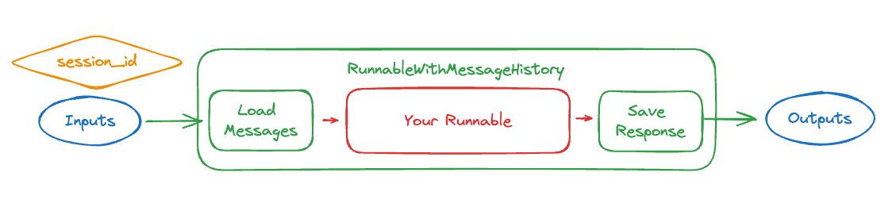

# 메시지 히스토리 추가 방법

:::info 전제 조건

이 가이드는 다음 개념에 대한 이해를 전제로 합니다:
- [LangChain 표현 언어 (LCEL)](/docs/concepts/#langchain-expression-language)
- [체인 가능한 실행 가능 객체 연결하기](/docs/how_to/sequence/)
- [런타임에서 체인 매개변수 구성하기](/docs/how_to/configure)
- [프롬프트 템플릿](/docs/concepts/#prompt-templates)
- [채팅 메시지](/docs/concepts/#message-types)

:::

챗봇을 구축할 때 대화 상태를 체인으로 전달하는 것은 매우 중요합니다. [`RunnableWithMessageHistory`](https://api.python.langchain.com/en/latest/runnables/langchain_core.runnables.history.RunnableWithMessageHistory.html#langchain_core.runnables.history.RunnableWithMessageHistory) 클래스는 특정 유형의 체인에 메시지 히스토리를 추가할 수 있게 해줍니다. 이 클래스는 다른 Runnable을 감싸고 그에 대한 채팅 메시지 히스토리를 관리합니다. 구체적으로, Runnable에 전달하기 전에 대화의 이전 메시지를 로드하고, Runnable을 호출한 후 생성된 응답을 메시지로 저장합니다. 이 클래스는 각 대화를 `session_id`로 저장하여 여러 대화를 가능하게 하며, Runnable을 호출할 때 구성에 `session_id`를 전달해야 하며, 이를 사용하여 관련 대화 히스토리를 조회합니다.



실제로는 다음과 같은 형태로 보입니다:

```python
<!--IMPORTS:[{"imported": "RunnableWithMessageHistory", "source": "langchain_core.runnables.history", "docs": "https://api.python.langchain.com/en/latest/runnables/langchain_core.runnables.history.RunnableWithMessageHistory.html", "title": "How to add message history"}]-->
from langchain_core.runnables.history import RunnableWithMessageHistory


with_message_history = RunnableWithMessageHistory(
    # The underlying runnable
    runnable,  
    # A function that takes in a session id and returns a memory object
    get_session_history,  
    # Other parameters that may be needed to align the inputs/outputs
    # of the Runnable with the memory object
    ...  
)

with_message_history.invoke(
    # The same input as before
    {"ability": "math", "input": "What does cosine mean?"},
    # Configuration specifying the `session_id`,
    # which controls which conversation to load
    config={"configurable": {"session_id": "abc123"}},
)
```


이를 제대로 설정하기 위해 고려해야 할 두 가지 주요 사항이 있습니다:

1. 메시지를 어떻게 저장하고 로드할 것인가? (위의 예에서 `get_session_history`입니다)
2. 감싸고 있는 기본 Runnable은 무엇이며 그 입력/출력은 무엇인가? (위의 예에서 `runnable`이며, 입력/출력을 정렬하기 위해 `RunnableWithMessageHistory`에 전달하는 추가 매개변수도 포함됩니다)

아래에서 이러한 요소(및 기타)를 살펴보겠습니다.

## 메시지를 저장하고 로드하는 방법

이것의 핵심 부분은 메시지를 저장하고 로드하는 것입니다.
`RunnableWithMessageHistory`를 구성할 때 `get_session_history` 함수를 전달해야 합니다.
이 함수는 `session_id`를 입력으로 받아 `BaseChatMessageHistory` 객체를 반환해야 합니다.

**`session_id`란 무엇인가?** 

`session_id`는 이러한 입력 메시지에 해당하는 세션(대화) 스레드의 식별자입니다. 이를 통해 동일한 체인으로 여러 대화/스레드를 동시에 유지할 수 있습니다.

**`BaseChatMessageHistory`란 무엇인가?** 

`BaseChatMessageHistory`는 메시지 객체를 로드하고 저장할 수 있는 클래스입니다. 이는 `RunnableWithMessageHistory`에 의해 호출되어 정확히 그 작업을 수행합니다. 이러한 클래스는 일반적으로 세션 ID로 초기화됩니다.

예제를 위해 사용할 `get_session_history` 객체를 생성해 보겠습니다. 간단하게 유지하기 위해 간단한 SQLiteMessage를 사용할 것입니다.

```python
! rm memory.db
```


```python
<!--IMPORTS:[{"imported": "SQLChatMessageHistory", "source": "langchain_community.chat_message_histories", "docs": "https://api.python.langchain.com/en/latest/chat_message_histories/langchain_community.chat_message_histories.sql.SQLChatMessageHistory.html", "title": "How to add message history"}]-->
from langchain_community.chat_message_histories import SQLChatMessageHistory


def get_session_history(session_id):
    return SQLChatMessageHistory(session_id, "sqlite:///memory.db")
```


다른 제공업체(Redis, Postgres 등)를 사용하여 채팅 메시지 히스토리를 구현한 내용을 보려면 [메모리 통합](https://integrations.langchain.com/memory) 페이지를 확인하세요.

## 감싸고자 하는 runnable은 무엇인가?

`RunnableWithMessageHistory`는 특정 유형의 Runnable만 감쌀 수 있습니다. 구체적으로, 다음 중 하나를 입력으로 받는 Runnable에 사용할 수 있습니다:

* [`BaseMessages`](/docs/concepts/#message-types)의 시퀀스
* `BaseMessages`의 시퀀스를 받는 키가 있는 dict
* 최신 메시지(들)를 문자열 또는 `BaseMessages`의 시퀀스로 받고, 별도의 키가 역사적 메시지를 받는 dict

그리고 출력으로는 다음 중 하나를 반환합니다:

* `AIMessage`의 내용으로 취급될 수 있는 문자열
* `BaseMessage`의 시퀀스
* `BaseMessage`의 시퀀스를 포함하는 키가 있는 dict

작동 방식을 보기 위해 몇 가지 예제를 살펴보겠습니다. 

### 설정

먼저 runnable을 구성합니다(여기서는 dict를 입력으로 받아 메시지를 출력으로 반환합니다):

import ChatModelTabs from "@theme/ChatModelTabs";

<ChatModelTabs
customVarName="llm"
/>

```python
<!--IMPORTS:[{"imported": "HumanMessage", "source": "langchain_core.messages", "docs": "https://api.python.langchain.com/en/latest/messages/langchain_core.messages.human.HumanMessage.html", "title": "How to add message history"}, {"imported": "RunnableWithMessageHistory", "source": "langchain_core.runnables.history", "docs": "https://api.python.langchain.com/en/latest/runnables/langchain_core.runnables.history.RunnableWithMessageHistory.html", "title": "How to add message history"}]-->
from langchain_core.messages import HumanMessage
from langchain_core.runnables.history import RunnableWithMessageHistory
```


### 메시지 입력, 메시지(들) 출력

가장 간단한 형태는 ChatModel에 메모리를 추가하는 것입니다.
ChatModels는 메시지 목록을 입력으로 받아 메시지를 출력합니다.
이로 인해 `RunnableWithMessageHistory`를 사용하는 것이 매우 쉬워집니다 - 추가 구성이 필요 없습니다!

```python
runnable_with_history = RunnableWithMessageHistory(
    model,
    get_session_history,
)
```


```python
runnable_with_history.invoke(
    [HumanMessage(content="hi - im bob!")],
    config={"configurable": {"session_id": "1"}},
)
```


```output
AIMessage(content="It's nice to meet you, Bob! I'm Claude, an AI assistant created by Anthropic. How can I help you today?", response_metadata={'id': 'msg_01UHCCMiZz9yNYjt41xUJrtk', 'model': 'claude-3-haiku-20240307', 'stop_reason': 'end_turn', 'stop_sequence': None, 'usage': {'input_tokens': 12, 'output_tokens': 32}}, id='run-55f6a451-606b-4e04-9e39-e03b81035c1f-0', usage_metadata={'input_tokens': 12, 'output_tokens': 32, 'total_tokens': 44})
```


```python
runnable_with_history.invoke(
    [HumanMessage(content="whats my name?")],
    config={"configurable": {"session_id": "1"}},
)
```


```output
AIMessage(content='I\'m afraid I don\'t actually know your name - you introduced yourself as Bob, but I don\'t have any other information about your identity. As an AI assistant, I don\'t have a way to independently verify people\'s names or identities. I\'m happy to continue our conversation, but I\'ll just refer to you as "Bob" since that\'s the name you provided.', response_metadata={'id': 'msg_018L96tAxiexMKsHBQz22CcE', 'model': 'claude-3-haiku-20240307', 'stop_reason': 'end_turn', 'stop_sequence': None, 'usage': {'input_tokens': 52, 'output_tokens': 80}}, id='run-7399ddb5-bb06-444b-bfb2-2f65674105dd-0', usage_metadata={'input_tokens': 52, 'output_tokens': 80, 'total_tokens': 132})
```


:::info

이 경우 제공된 `session_id`에 대한 채팅 히스토리를 통해 컨텍스트가 유지되므로 모델은 사용자의 이름을 알고 있습니다.

:::

이제 새로운 세션 ID로 시도해보고 기억하지 않는지 확인할 수 있습니다.

```python
runnable_with_history.invoke(
    [HumanMessage(content="whats my name?")],
    config={"configurable": {"session_id": "1a"}},
)
```


```output
AIMessage(content="I'm afraid I don't actually know your name. As an AI assistant, I don't have personal information about you unless you provide it to me directly.", response_metadata={'id': 'msg_01LhbWu7mSKTvKAx7iQpMPzd', 'model': 'claude-3-haiku-20240307', 'stop_reason': 'end_turn', 'stop_sequence': None, 'usage': {'input_tokens': 12, 'output_tokens': 35}}, id='run-cf86cad2-21f2-4525-afc8-09bfd1e8af70-0', usage_metadata={'input_tokens': 12, 'output_tokens': 35, 'total_tokens': 47})
```


:::info      

다른 `session_id`를 전달하면 새로운 채팅 히스토리가 시작되므로 모델은 사용자의 이름을 알지 못합니다. 

:::

### 사전 입력, 메시지(들) 출력

원시 모델을 감싸는 것 외에도 다음 단계는 프롬프트 + LLM을 감싸는 것입니다. 이로 인해 입력이 **사전**으로 변경됩니다(프롬프트의 입력은 사전이기 때문입니다). 이는 두 가지 복잡성을 추가합니다.

첫째: 사전에는 여러 키가 있을 수 있지만, 우리는 입력으로 저장할 하나만 원합니다. 이를 위해 이제 입력으로 저장할 키를 지정해야 합니다.

둘째: 메시지를 로드한 후에는 이를 사전에 어떻게 저장할지 알아야 합니다. 이는 사전에서 메시지를 저장할 키를 아는 것과 같습니다. 따라서 로드된 메시지를 저장할 키를 지정해야 합니다.

모든 것을 종합하면 다음과 같은 형태가 됩니다:

```python
<!--IMPORTS:[{"imported": "ChatPromptTemplate", "source": "langchain_core.prompts", "docs": "https://api.python.langchain.com/en/latest/prompts/langchain_core.prompts.chat.ChatPromptTemplate.html", "title": "How to add message history"}, {"imported": "MessagesPlaceholder", "source": "langchain_core.prompts", "docs": "https://api.python.langchain.com/en/latest/prompts/langchain_core.prompts.chat.MessagesPlaceholder.html", "title": "How to add message history"}]-->
from langchain_core.prompts import ChatPromptTemplate, MessagesPlaceholder

prompt = ChatPromptTemplate.from_messages(
    [
        (
            "system",
            "You're an assistant who speaks in {language}. Respond in 20 words or fewer",
        ),
        MessagesPlaceholder(variable_name="history"),
        ("human", "{input}"),
    ]
)

runnable = prompt | model

runnable_with_history = RunnableWithMessageHistory(
    runnable,
    get_session_history,
    input_messages_key="input",
    history_messages_key="history",
)
```


:::info

여기서 `input_messages_key`(최신 입력 메시지로 취급될 키)와 `history_messages_key`(역사적 메시지를 추가할 키)를 지정했습니다.

:::

```python
runnable_with_history.invoke(
    {"language": "italian", "input": "hi im bob!"},
    config={"configurable": {"session_id": "2"}},
)
```


```output
AIMessage(content='Ciao Bob! È un piacere conoscerti. Come stai oggi?', response_metadata={'id': 'msg_0121ADUEe4G1hMC6zbqFWofr', 'model': 'claude-3-haiku-20240307', 'stop_reason': 'end_turn', 'stop_sequence': None, 'usage': {'input_tokens': 29, 'output_tokens': 23}}, id='run-246a70df-aad6-43d6-a7e8-166d96e0d67e-0', usage_metadata={'input_tokens': 29, 'output_tokens': 23, 'total_tokens': 52})
```


```python
runnable_with_history.invoke(
    {"language": "italian", "input": "whats my name?"},
    config={"configurable": {"session_id": "2"}},
)
```


```output
AIMessage(content='Bob, il tuo nome è Bob.', response_metadata={'id': 'msg_01EDUZG6nRLGeti9KhFN5cek', 'model': 'claude-3-haiku-20240307', 'stop_reason': 'end_turn', 'stop_sequence': None, 'usage': {'input_tokens': 60, 'output_tokens': 12}}, id='run-294b4a72-81bc-4c43-b199-3aafdff87cb3-0', usage_metadata={'input_tokens': 60, 'output_tokens': 12, 'total_tokens': 72})
```


:::info

이 경우 제공된 `session_id`에 대한 채팅 히스토리를 통해 컨텍스트가 유지되므로 모델은 사용자의 이름을 알고 있습니다.

:::

이제 새로운 세션 ID로 시도해보고 기억하지 않는지 확인할 수 있습니다.

```python
runnable_with_history.invoke(
    {"language": "italian", "input": "whats my name?"},
    config={"configurable": {"session_id": "2a"}},
)
```


```output
AIMessage(content='Mi dispiace, non so il tuo nome. Come posso aiutarti?', response_metadata={'id': 'msg_01Lyd9FAGQJTxxAZoFi3sQpQ', 'model': 'claude-3-haiku-20240307', 'stop_reason': 'end_turn', 'stop_sequence': None, 'usage': {'input_tokens': 30, 'output_tokens': 23}}, id='run-19a82197-3b1c-4b5f-a68d-f91f4a2ba523-0', usage_metadata={'input_tokens': 30, 'output_tokens': 23, 'total_tokens': 53})
```


:::info      

다른 `session_id`를 전달하면 새로운 채팅 히스토리가 시작되므로 모델은 사용자의 이름을 알지 못합니다. 

:::

### 메시지 입력, dict 출력

이 형식은 모델을 사용하여 사전의 하나의 키를 생성할 때 유용합니다.

```python
<!--IMPORTS:[{"imported": "HumanMessage", "source": "langchain_core.messages", "docs": "https://api.python.langchain.com/en/latest/messages/langchain_core.messages.human.HumanMessage.html", "title": "How to add message history"}, {"imported": "RunnableParallel", "source": "langchain_core.runnables", "docs": "https://api.python.langchain.com/en/latest/runnables/langchain_core.runnables.base.RunnableParallel.html", "title": "How to add message history"}]-->
from langchain_core.messages import HumanMessage
from langchain_core.runnables import RunnableParallel

chain = RunnableParallel({"output_message": model})


runnable_with_history = RunnableWithMessageHistory(
    chain,
    get_session_history,
    output_messages_key="output_message",
)
```


:::info

여기서 `output_messages_key`(저장할 출력으로 취급될 키)를 지정했습니다.

:::

```python
runnable_with_history.invoke(
    [HumanMessage(content="hi - im bob!")],
    config={"configurable": {"session_id": "3"}},
)
```


```output
{'output_message': AIMessage(content="It's nice to meet you, Bob! I'm Claude, an AI assistant created by Anthropic. How can I help you today?", response_metadata={'id': 'msg_01WWJSyUyGGKuBqTs3h18ZMM', 'model': 'claude-3-haiku-20240307', 'stop_reason': 'end_turn', 'stop_sequence': None, 'usage': {'input_tokens': 12, 'output_tokens': 32}}, id='run-0f50cb43-a734-447c-b535-07c615a0984c-0', usage_metadata={'input_tokens': 12, 'output_tokens': 32, 'total_tokens': 44})}
```


```python
runnable_with_history.invoke(
    [HumanMessage(content="whats my name?")],
    config={"configurable": {"session_id": "3"}},
)
```


```output
{'output_message': AIMessage(content='I\'m afraid I don\'t actually know your name - you introduced yourself as Bob, but I don\'t have any other information about your identity. As an AI assistant, I don\'t have a way to independently verify people\'s names or identities. I\'m happy to continue our conversation, but I\'ll just refer to you as "Bob" since that\'s the name you provided.', response_metadata={'id': 'msg_01TEGrhfLXTwo36rC7svdTy4', 'model': 'claude-3-haiku-20240307', 'stop_reason': 'end_turn', 'stop_sequence': None, 'usage': {'input_tokens': 52, 'output_tokens': 80}}, id='run-178e8f3f-da21-430d-9edc-ef07797a5e2d-0', usage_metadata={'input_tokens': 52, 'output_tokens': 80, 'total_tokens': 132})}
```


:::info

이 경우 제공된 `session_id`에 대한 채팅 히스토리를 통해 컨텍스트가 유지되므로 모델은 사용자의 이름을 알고 있습니다.

:::

이제 새로운 세션 ID로 시도해보고 기억하지 않는지 확인할 수 있습니다.

```python
runnable_with_history.invoke(
    [HumanMessage(content="whats my name?")],
    config={"configurable": {"session_id": "3a"}},
)
```


```output
{'output_message': AIMessage(content="I'm afraid I don't actually know your name. As an AI assistant, I don't have personal information about you unless you provide it to me directly.", response_metadata={'id': 'msg_0118ZBudDXAC9P6smf91NhCX', 'model': 'claude-3-haiku-20240307', 'stop_reason': 'end_turn', 'stop_sequence': None, 'usage': {'input_tokens': 12, 'output_tokens': 35}}, id='run-deb14a3a-0336-42b4-8ace-ad1e52ca5910-0', usage_metadata={'input_tokens': 12, 'output_tokens': 35, 'total_tokens': 47})}
```


:::info      

다른 `session_id`를 전달하면 새로운 채팅 히스토리가 시작되므로 모델은 사용자의 이름을 알지 못합니다. 

:::

### 모든 메시지 입력에 대한 단일 키가 있는 dict, 메시지 출력

이는 "사전 입력, 메시지(들) 출력"의 특정 경우입니다. 이 상황에서는 단일 키만 있기 때문에 그다지 많이 지정할 필요가 없습니다 - `input_messages_key`만 지정하면 됩니다.

```python
from operator import itemgetter

runnable_with_history = RunnableWithMessageHistory(
    itemgetter("input_messages") | model,
    get_session_history,
    input_messages_key="input_messages",
)
```


:::info

여기서 `input_messages_key`(최신 입력 메시지로 취급될 키)를 지정했습니다.

:::

```python
runnable_with_history.invoke(
    {"input_messages": [HumanMessage(content="hi - im bob!")]},
    config={"configurable": {"session_id": "4"}},
)
```


```output
AIMessage(content="It's nice to meet you, Bob! I'm Claude, an AI assistant created by Anthropic. How can I help you today?", response_metadata={'id': 'msg_01UdD5wz1J5xwoz5D94onaQC', 'model': 'claude-3-haiku-20240307', 'stop_reason': 'end_turn', 'stop_sequence': None, 'usage': {'input_tokens': 12, 'output_tokens': 32}}, id='run-91bee6eb-0814-4557-ad71-fef9b0270358-0', usage_metadata={'input_tokens': 12, 'output_tokens': 32, 'total_tokens': 44})
```


```python
runnable_with_history.invoke(
    {"input_messages": [HumanMessage(content="whats my name?")]},
    config={"configurable": {"session_id": "4"}},
)
```


```output
AIMessage(content='I\'m afraid I don\'t actually know your name - you introduced yourself as Bob, but I don\'t have any other information about your identity. As an AI assistant, I don\'t have a way to independently verify people\'s names or identities. I\'m happy to continue our conversation, but I\'ll just refer to you as "Bob" since that\'s the name you provided.', response_metadata={'id': 'msg_012WUygxBKXcVJPeTW14LNrc', 'model': 'claude-3-haiku-20240307', 'stop_reason': 'end_turn', 'stop_sequence': None, 'usage': {'input_tokens': 52, 'output_tokens': 80}}, id='run-fcbaaa1a-8c33-4eec-b0b0-5b800a47bddd-0', usage_metadata={'input_tokens': 52, 'output_tokens': 80, 'total_tokens': 132})
```


:::info

이 경우 제공된 `session_id`에 대한 채팅 히스토리를 통해 컨텍스트가 유지되므로 모델은 사용자의 이름을 알고 있습니다.

:::

이제 새로운 세션 ID로 시도해보고 기억하지 않는지 확인할 수 있습니다.

```python
runnable_with_history.invoke(
    {"input_messages": [HumanMessage(content="whats my name?")]},
    config={"configurable": {"session_id": "4a"}},
)
```


```output
AIMessage(content="I'm afraid I don't actually know your name. As an AI assistant, I don't have personal information about you unless you provide it to me directly.", response_metadata={'id': 'msg_017xW3Ki5y4UBYzCU9Mf1pgM', 'model': 'claude-3-haiku-20240307', 'stop_reason': 'end_turn', 'stop_sequence': None, 'usage': {'input_tokens': 12, 'output_tokens': 35}}, id='run-d2f372f7-3679-4a5c-9331-a55b820ec03e-0', usage_metadata={'input_tokens': 12, 'output_tokens': 35, 'total_tokens': 47})
```


:::info      

다른 `session_id`를 전달하면 새로운 채팅 히스토리가 시작되므로 모델은 사용자의 이름을 알지 못합니다. 

:::

## 사용자 정의

메시지 히스토리를 추적하는 구성 매개변수는 `history_factory_config` 매개변수에 `ConfigurableFieldSpec` 객체 목록을 전달하여 사용자 정의할 수 있습니다. 아래에서는 두 개의 매개변수: `user_id`와 `conversation_id`를 사용합니다.

```python
<!--IMPORTS:[{"imported": "ConfigurableFieldSpec", "source": "langchain_core.runnables", "docs": "https://api.python.langchain.com/en/latest/runnables/langchain_core.runnables.utils.ConfigurableFieldSpec.html", "title": "How to add message history"}]-->
from langchain_core.runnables import ConfigurableFieldSpec


def get_session_history(user_id: str, conversation_id: str):
    return SQLChatMessageHistory(f"{user_id}--{conversation_id}", "sqlite:///memory.db")


with_message_history = RunnableWithMessageHistory(
    runnable,
    get_session_history,
    input_messages_key="input",
    history_messages_key="history",
    history_factory_config=[
        ConfigurableFieldSpec(
            id="user_id",
            annotation=str,
            name="User ID",
            description="Unique identifier for the user.",
            default="",
            is_shared=True,
        ),
        ConfigurableFieldSpec(
            id="conversation_id",
            annotation=str,
            name="Conversation ID",
            description="Unique identifier for the conversation.",
            default="",
            is_shared=True,
        ),
    ],
)

with_message_history.invoke(
    {"language": "italian", "input": "hi im bob!"},
    config={"configurable": {"user_id": "123", "conversation_id": "1"}},
)
```


```output
AIMessage(content='Ciao Bob! È un piacere conoscerti. Come stai oggi?', response_metadata={'id': 'msg_016RJebCoiAgWaNcbv9wrMNW', 'model': 'claude-3-haiku-20240307', 'stop_reason': 'end_turn', 'stop_sequence': None, 'usage': {'input_tokens': 29, 'output_tokens': 23}}, id='run-40425414-8f72-47d4-bf1d-a84175d8b3f8-0', usage_metadata={'input_tokens': 29, 'output_tokens': 23, 'total_tokens': 52})
```


```python
# remembers
with_message_history.invoke(
    {"language": "italian", "input": "whats my name?"},
    config={"configurable": {"user_id": "123", "conversation_id": "1"}},
)
```


```output
AIMessage(content='Bob, il tuo nome è Bob.', response_metadata={'id': 'msg_01Kktiy3auFDKESY54KtTWPX', 'model': 'claude-3-haiku-20240307', 'stop_reason': 'end_turn', 'stop_sequence': None, 'usage': {'input_tokens': 60, 'output_tokens': 12}}, id='run-c7768420-3f30-43f5-8834-74b1979630dd-0', usage_metadata={'input_tokens': 60, 'output_tokens': 12, 'total_tokens': 72})
```


```python
# New user_id --> does not remember
with_message_history.invoke(
    {"language": "italian", "input": "whats my name?"},
    config={"configurable": {"user_id": "456", "conversation_id": "1"}},
)
```


```output
AIMessage(content='Mi dispiace, non so il tuo nome. Come posso aiutarti?', response_metadata={'id': 'msg_0178FpbpPNioB7kqvyHk7rjD', 'model': 'claude-3-haiku-20240307', 'stop_reason': 'end_turn', 'stop_sequence': None, 'usage': {'input_tokens': 30, 'output_tokens': 23}}, id='run-df1f1768-aab6-4aec-8bba-e33fc9e90b8d-0', usage_metadata={'input_tokens': 30, 'output_tokens': 23, 'total_tokens': 53})
```


이 경우 동일한 `user_id`에 대해 컨텍스트가 유지되었지만, 이를 변경하자 새로운 채팅 히스토리가 시작되었습니다. `conversation_id`는 동일했음에도 불구하고 말입니다.