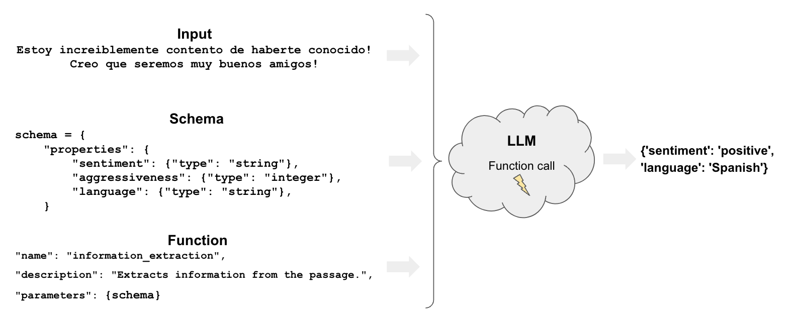

[](https://colab.research.google.com/github/langchain-ai/langchain/blob/master/docs/docs/use_cases/tagging.ipynb)

# 텍스트를 레이블로 분류하기

태깅은 문서에 다음과 같은 클래스 레이블을 지정하는 것을 의미합니다:

- 감정
- 언어
- 스타일 (격식적, 비격식적 등)
- 다룬 주제
- 정치적 경향



## 개요

태깅에는 몇 가지 구성 요소가 있습니다:

* `function`: [추출](/docs/tutorials/extraction)과 마찬가지로, 태깅은 모델이 문서를 태그하는 방법을 지정하기 위해 [함수](https://openai.com/blog/function-calling-and-other-api-updates)를 사용합니다.
* `schema`: 문서를 태그하는 방법을 정의합니다.

## 빠른 시작

LangChain에서 태깅을 위해 OpenAI 도구 호출을 사용하는 매우 간단한 예제를 살펴보겠습니다. OpenAI 모델에서 지원하는 [`with_structured_output`](/docs/how_to/structured_output) 메서드를 사용할 것입니다:

```python
%pip install --upgrade --quiet langchain langchain-openai

# Set env var OPENAI_API_KEY or load from a .env file:
# import dotenv
# dotenv.load_dotenv()
```


우리의 스키마에서 몇 가지 속성과 그 예상 유형을 가진 Pydantic 모델을 지정해 보겠습니다.

```python
<!--IMPORTS:[{"imported": "ChatPromptTemplate", "source": "langchain_core.prompts", "docs": "https://api.python.langchain.com/en/latest/prompts/langchain_core.prompts.chat.ChatPromptTemplate.html", "title": "Classify Text into Labels"}, {"imported": "ChatOpenAI", "source": "langchain_openai", "docs": "https://api.python.langchain.com/en/latest/chat_models/langchain_openai.chat_models.base.ChatOpenAI.html", "title": "Classify Text into Labels"}]-->
from langchain_core.prompts import ChatPromptTemplate
from langchain_core.pydantic_v1 import BaseModel, Field
from langchain_openai import ChatOpenAI

tagging_prompt = ChatPromptTemplate.from_template(
    """
Extract the desired information from the following passage.

Only extract the properties mentioned in the 'Classification' function.

Passage:
{input}
"""
)


class Classification(BaseModel):
    sentiment: str = Field(description="The sentiment of the text")
    aggressiveness: int = Field(
        description="How aggressive the text is on a scale from 1 to 10"
    )
    language: str = Field(description="The language the text is written in")


# LLM
llm = ChatOpenAI(temperature=0, model="gpt-3.5-turbo-0125").with_structured_output(
    Classification
)

tagging_chain = tagging_prompt | llm
```


```python
inp = "Estoy increiblemente contento de haberte conocido! Creo que seremos muy buenos amigos!"
tagging_chain.invoke({"input": inp})
```


```output
Classification(sentiment='positive', aggressiveness=1, language='Spanish')
```


JSON 출력을 원한다면, 그냥 `.dict()`를 호출하면 됩니다.

```python
inp = "Estoy muy enojado con vos! Te voy a dar tu merecido!"
res = tagging_chain.invoke({"input": inp})
res.dict()
```


```output
{'sentiment': 'negative', 'aggressiveness': 8, 'language': 'Spanish'}
```


예제에서 볼 수 있듯이, 우리가 원하는 것을 정확하게 해석합니다.

결과는 다양하게 나타나므로, 예를 들어 다른 언어('positive', 'enojado' 등)의 감정을 얻을 수 있습니다.

다음 섹션에서는 이러한 결과를 제어하는 방법을 살펴보겠습니다.

## 세부 제어

신중한 스키마 정의는 모델의 출력에 대한 더 많은 제어를 제공합니다.

특히, 우리는 다음을 정의할 수 있습니다:

- 각 속성에 대한 가능한 값
- 모델이 속성을 이해하도록 보장하기 위한 설명
- 반환되어야 할 필수 속성

이제 이전에 언급한 각 측면을 제어하기 위해 Pydantic 모델을 다시 선언해 보겠습니다. 

```python
class Classification(BaseModel):
    sentiment: str = Field(..., enum=["happy", "neutral", "sad"])
    aggressiveness: int = Field(
        ...,
        description="describes how aggressive the statement is, the higher the number the more aggressive",
        enum=[1, 2, 3, 4, 5],
    )
    language: str = Field(
        ..., enum=["spanish", "english", "french", "german", "italian"]
    )
```


```python
tagging_prompt = ChatPromptTemplate.from_template(
    """
Extract the desired information from the following passage.

Only extract the properties mentioned in the 'Classification' function.

Passage:
{input}
"""
)

llm = ChatOpenAI(temperature=0, model="gpt-3.5-turbo-0125").with_structured_output(
    Classification
)

chain = tagging_prompt | llm
```


이제 답변은 우리가 기대하는 방식으로 제한됩니다!

```python
inp = "Estoy increiblemente contento de haberte conocido! Creo que seremos muy buenos amigos!"
chain.invoke({"input": inp})
```


```output
Classification(sentiment='happy', aggressiveness=1, language='spanish')
```


```python
inp = "Estoy muy enojado con vos! Te voy a dar tu merecido!"
chain.invoke({"input": inp})
```


```output
Classification(sentiment='sad', aggressiveness=5, language='spanish')
```


```python
inp = "Weather is ok here, I can go outside without much more than a coat"
chain.invoke({"input": inp})
```


```output
Classification(sentiment='neutral', aggressiveness=2, language='english')
```


[LangSmith trace](https://smith.langchain.com/public/38294e04-33d8-4c5a-ae92-c2fe68be8332/r)는 내부를 엿볼 수 있게 해줍니다:


### 더 깊이 들어가기

* [메타데이터 태거](/docs/integrations/document_transformers/openai_metadata_tagger) 문서 변환기를 사용하여 LangChain `Document`에서 메타데이터를 추출할 수 있습니다.
* 이는 태깅 체인과 동일한 기본 기능을 포함하지만, LangChain `Document`에 적용됩니다.