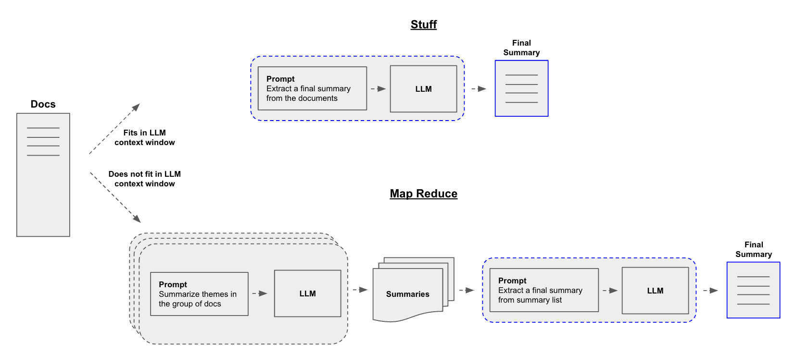
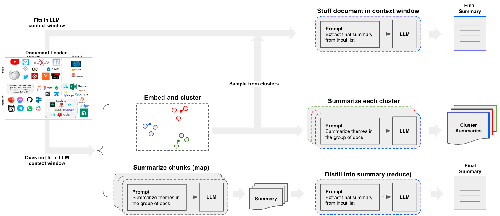

# Summarize Text

Suppose you have a set of documents (PDFs, Notion pages, customer questions, etc.) and you want to summarize the content. 

LLMs are a great tool for this given their proficiency in understanding and synthesizing text.

In the context of [retrieval-augmented generation](/docs/tutorials/rag), summarizing text can help distill the information in a large number of retrieved documents to provide context for a LLM.

In this walkthrough we'll go over how to summarize content from multiple documents using LLMs.


## Concepts

Concepts we will cover are:

- Using [language models](/docs/concepts/#chat-models).

- Using [document loaders](/docs/concepts/#document-loaders), specifically the [WebBaseLoader](https://api.python.langchain.com/en/latest/document_loaders/langchain_community.document_loaders.web_base.WebBaseLoader.html) to load content from an HTML webpage.

- Three ways to summarize or otherwise combine documents.
  1. [Stuff](/docs/tutorials/summarization#stuff), which simply concatenates documents into a prompt;
  2. [Map-reduce](/docs/tutorials/summarization#map-reduce), which splits documents into batches, summarizes those, and then summarizes the summaries;
  3. [Refine](/docs/tutorials/summarization#refine), which updates a rolling summary be iterating over the documents in a sequence.

That's a fair amount to cover! Let's dive in.

## Setup

### Jupyter Notebook

This guide (and most of the other guides in the documentation) uses [Jupyter notebooks](https://jupyter.org/) and assumes the reader is as well. Jupyter notebooks are perfect for learning how to work with LLM systems because oftentimes things can go wrong (unexpected output, API down, etc) and going through guides in an interactive environment is a great way to better understand them.

This and other tutorials are perhaps most conveniently run in a Jupyter notebook. See [here](https://jupyter.org/install) for instructions on how to install.

### Installation

To install LangChain run:

import Tabs from '@theme/Tabs';
import TabItem from '@theme/TabItem';
import CodeBlock from "@theme/CodeBlock";

<Tabs>
  <TabItem value="pip" label="Pip" default>
    <CodeBlock language="bash">pip install langchain</CodeBlock>
  </TabItem>
  <TabItem value="conda" label="Conda">
    <CodeBlock language="bash">conda install langchain -c conda-forge</CodeBlock>
  </TabItem>
</Tabs>


For more details, see our [Installation guide](/docs/how_to/installation).

### LangSmith

Many of the applications you build with LangChain will contain multiple steps with multiple invocations of LLM calls.
As these applications get more and more complex, it becomes crucial to be able to inspect what exactly is going on inside your chain or agent.
The best way to do this is with [LangSmith](https://smith.langchain.com).

After you sign up at the link above, make sure to set your environment variables to start logging traces:

```shell
export LANGCHAIN_TRACING_V2="true"
export LANGCHAIN_API_KEY="..."
```

Or, if in a notebook, you can set them with:

```python
import getpass
import os

os.environ["LANGCHAIN_TRACING_V2"] = "true"
os.environ["LANGCHAIN_API_KEY"] = getpass.getpass()
```

## Overview

A central question for building a summarizer is how to pass your documents into the LLM's context window. Three common approaches for this are:

1. `Stuff`: Simply "stuff" all your documents into a single prompt. This is the simplest approach (see [here](/docs/tutorials/rag#built-in-chains) for more on the `create_stuff_documents_chain` constructor, which is used for this method).

2. `Map-reduce`: Summarize each document on its own in a "map" step and then "reduce" the summaries into a final summary (see [here](https://api.python.langchain.com/en/latest/chains/langchain.chains.combine_documents.map_reduce.MapReduceDocumentsChain.html) for more on the `MapReduceDocumentsChain`, which is used for this method).

3. `Refine`: Update a rolling summary be iterating over the documents in a sequence.
   
   



## Quickstart

To give you a sneak preview, either pipeline can be wrapped in a single object: `load_summarize_chain`. 

Suppose we want to summarize a blog post. We can create this in a few lines of code.

First set environment variables and install packages:


```python
%pip install --upgrade --quiet  langchain-openai tiktoken chromadb langchain

# Set env var OPENAI_API_KEY or load from a .env file
# import dotenv

# dotenv.load_dotenv()
```

We can use `chain_type="stuff"`, especially if using larger context window models such as:

* 128k token OpenAI `gpt-4-turbo-2024-04-09` 
* 200k token Anthropic `claude-3-sonnet-20240229`

We can also supply `chain_type="map_reduce"` or `chain_type="refine"`.

First we load in our documents. We will use [WebBaseLoader](https://api.python.langchain.com/en/latest/document_loaders/langchain_community.document_loaders.web_base.WebBaseLoader.html) to load a blog post:


```python
import os

os.environ["LANGCHAIN_TRACING_V2"] = "True"
```


```python
<!--IMPORTS:[{"imported": "load_summarize_chain", "source": "langchain.chains.summarize", "docs": "https://api.python.langchain.com/en/latest/chains/langchain.chains.summarize.chain.load_summarize_chain.html", "title": "Summarize Text"}, {"imported": "WebBaseLoader", "source": "langchain_community.document_loaders", "docs": "https://api.python.langchain.com/en/latest/document_loaders/langchain_community.document_loaders.web_base.WebBaseLoader.html", "title": "Summarize Text"}, {"imported": "ChatOpenAI", "source": "langchain_openai", "docs": "https://api.python.langchain.com/en/latest/chat_models/langchain_openai.chat_models.base.ChatOpenAI.html", "title": "Summarize Text"}]-->
from langchain.chains.summarize import load_summarize_chain
from langchain_community.document_loaders import WebBaseLoader
from langchain_openai import ChatOpenAI

loader = WebBaseLoader("https://lilianweng.github.io/posts/2023-06-23-agent/")
docs = loader.load()

llm = ChatOpenAI(temperature=0, model_name="gpt-3.5-turbo-1106")
chain = load_summarize_chain(llm, chain_type="stuff")

result = chain.invoke(docs)

print(result["output_text"])
```
```output
The article discusses the concept of LLM-powered autonomous agents, with a focus on the components of planning, memory, and tool use. It includes case studies and proof-of-concept examples, as well as challenges and references to related research. The author emphasizes the potential of LLMs in creating powerful problem-solving agents, while also highlighting limitations such as finite context length and reliability of natural language interfaces.
```
## Option 1. Stuff {#stuff}

When we use `load_summarize_chain` with `chain_type="stuff"`, we will use the [StuffDocumentsChain](https://api.python.langchain.com/en/latest/chains/langchain.chains.combine_documents.stuff.StuffDocumentsChain.html#langchain.chains.combine_documents.stuff.StuffDocumentsChain).

The chain will take a list of documents, insert them all into a prompt, and pass that prompt to an LLM:


```python
<!--IMPORTS:[{"imported": "StuffDocumentsChain", "source": "langchain.chains.combine_documents.stuff", "docs": "https://api.python.langchain.com/en/latest/chains/langchain.chains.combine_documents.stuff.StuffDocumentsChain.html", "title": "Summarize Text"}, {"imported": "LLMChain", "source": "langchain.chains.llm", "docs": "https://api.python.langchain.com/en/latest/chains/langchain.chains.llm.LLMChain.html", "title": "Summarize Text"}, {"imported": "PromptTemplate", "source": "langchain_core.prompts", "docs": "https://api.python.langchain.com/en/latest/prompts/langchain_core.prompts.prompt.PromptTemplate.html", "title": "Summarize Text"}]-->
from langchain.chains.combine_documents.stuff import StuffDocumentsChain
from langchain.chains.llm import LLMChain
from langchain_core.prompts import PromptTemplate

# Define prompt
prompt_template = """Write a concise summary of the following:
"{text}"
CONCISE SUMMARY:"""
prompt = PromptTemplate.from_template(prompt_template)

# Define LLM chain
llm = ChatOpenAI(temperature=0, model_name="gpt-3.5-turbo-16k")
llm_chain = LLMChain(llm=llm, prompt=prompt)

# Define StuffDocumentsChain
stuff_chain = StuffDocumentsChain(llm_chain=llm_chain, document_variable_name="text")

docs = loader.load()
print(stuff_chain.invoke(docs)["output_text"])
```
```output
The article discusses the concept of building autonomous agents powered by large language models (LLMs). It explores the components of such agents, including planning, memory, and tool use. The article provides case studies and examples of proof-of-concept demos, highlighting the challenges and limitations of LLM-powered agents. It also includes references to related research papers and projects.
```
Great! We can see that we reproduce the earlier result using the `load_summarize_chain`.

### Go deeper

* You can easily customize the prompt. 
* You can easily try different LLMs, (e.g., [Claude](/docs/integrations/chat/anthropic)) via the `llm` parameter.

## Option 2. Map-Reduce {#map-reduce}

Let's unpack the map reduce approach. For this, we'll first map each document to an individual summary using an `LLMChain`. Then we'll use a `ReduceDocumentsChain` to combine those summaries into a single global summary.
 
First, we specify the LLMChain to use for mapping each document to an individual summary:


```python
<!--IMPORTS:[{"imported": "MapReduceDocumentsChain", "source": "langchain.chains", "docs": "https://api.python.langchain.com/en/latest/chains/langchain.chains.combine_documents.map_reduce.MapReduceDocumentsChain.html", "title": "Summarize Text"}, {"imported": "ReduceDocumentsChain", "source": "langchain.chains", "docs": "https://api.python.langchain.com/en/latest/chains/langchain.chains.combine_documents.reduce.ReduceDocumentsChain.html", "title": "Summarize Text"}, {"imported": "CharacterTextSplitter", "source": "langchain_text_splitters", "docs": "https://api.python.langchain.com/en/latest/character/langchain_text_splitters.character.CharacterTextSplitter.html", "title": "Summarize Text"}]-->
from langchain.chains import MapReduceDocumentsChain, ReduceDocumentsChain
from langchain_text_splitters import CharacterTextSplitter

llm = ChatOpenAI(temperature=0)

# Map
map_template = """The following is a set of documents
{docs}
Based on this list of docs, please identify the main themes 
Helpful Answer:"""
map_prompt = PromptTemplate.from_template(map_template)
map_chain = LLMChain(llm=llm, prompt=map_prompt)
```

We can also use the Prompt Hub to store and fetch prompts.

This will work with your [LangSmith API key](https://docs.smith.langchain.com/).

For example, see the map prompt [here](https://smith.langchain.com/hub/rlm/map-prompt).


```python
from langchain import hub

map_prompt = hub.pull("rlm/map-prompt")
map_chain = LLMChain(llm=llm, prompt=map_prompt)
```

The `ReduceDocumentsChain` handles taking the document mapping results and reducing them into a single output. It wraps a generic `CombineDocumentsChain` (like `StuffDocumentsChain`) but adds the ability to collapse documents before passing it to the `CombineDocumentsChain` if their cumulative size exceeds `token_max`. In this example, we can actually re-use our chain for combining our docs to also collapse our docs.

So if the cumulative number of tokens in our mapped documents exceeds 4000 tokens, then we'll recursively pass in the documents in batches of < 4000 tokens to our `StuffDocumentsChain` to create batched summaries. And once those batched summaries are cumulatively less than 4000 tokens, we'll pass them all one last time to the `StuffDocumentsChain` to create the final summary.


```python
# Reduce
reduce_template = """The following is set of summaries:
{docs}
Take these and distill it into a final, consolidated summary of the main themes. 
Helpful Answer:"""
reduce_prompt = PromptTemplate.from_template(reduce_template)
```


```python
# Note we can also get this from the prompt hub, as noted above
reduce_prompt = hub.pull("rlm/reduce-prompt")
```


```python
reduce_prompt
```


```output
ChatPromptTemplate(input_variables=['docs'], metadata={'lc_hub_owner': 'rlm', 'lc_hub_repo': 'map-prompt', 'lc_hub_commit_hash': 'de4fba345f211a462584fc25b7077e69c1ba6cdcf4e21b7ec9abe457ddb16c87'}, messages=[HumanMessagePromptTemplate(prompt=PromptTemplate(input_variables=['docs'], template='The following is a set of documents:\n{docs}\nBased on this list of docs, please identify the main themes \nHelpful Answer:'))])
```


```python
# Run chain
reduce_chain = LLMChain(llm=llm, prompt=reduce_prompt)

# Takes a list of documents, combines them into a single string, and passes this to an LLMChain
combine_documents_chain = StuffDocumentsChain(
    llm_chain=reduce_chain, document_variable_name="docs"
)

# Combines and iteratively reduces the mapped documents
reduce_documents_chain = ReduceDocumentsChain(
    # This is final chain that is called.
    combine_documents_chain=combine_documents_chain,
    # If documents exceed context for `StuffDocumentsChain`
    collapse_documents_chain=combine_documents_chain,
    # The maximum number of tokens to group documents into.
    token_max=4000,
)
```

Combining our map and reduce chains into one:


```python
# Combining documents by mapping a chain over them, then combining results
map_reduce_chain = MapReduceDocumentsChain(
    # Map chain
    llm_chain=map_chain,
    # Reduce chain
    reduce_documents_chain=reduce_documents_chain,
    # The variable name in the llm_chain to put the documents in
    document_variable_name="docs",
    # Return the results of the map steps in the output
    return_intermediate_steps=False,
)

text_splitter = CharacterTextSplitter.from_tiktoken_encoder(
    chunk_size=1000, chunk_overlap=0
)
split_docs = text_splitter.split_documents(docs)
```
```output
Created a chunk of size 1003, which is longer than the specified 1000
```

```python
result = map_reduce_chain.invoke(split_docs)

print(result["output_text"])
```
```output
The main themes identified in the list of documents provided are related to large language models (LLMs), autonomous agents, prompting, steering language models, natural language processing (NLP), the use of tools to augment language models, reinforcement learning, reasoning, acting, self-reflection, and the integration of language models with external knowledge sources.
```
If we follow the [Langsmith Trace](https://smith.langchain.com/public/3a1a6d51-68e5-4805-8d90-78920ce60a51/r), we can see the the individual LLM summarizations, including the [final call](https://smith.langchain.com/public/69482813-f0b7-46b0-a99f-86d56fc9644a/r) that summarizes the summaries.

### Go deeper
 
**Customization** 

* As shown above, you can customize the LLMs and prompts for map and reduce stages.

**Real-world use-case**

* See [this blog post](https://blog.langchain.dev/llms-to-improve-documentation/) case-study on analyzing user interactions (questions about LangChain documentation)!  
* The blog post and associated [repo](https://github.com/mendableai/QA_clustering) also introduce clustering as a means of summarization.
* This opens up another path beyond the `stuff` or `map-reduce` approaches that is worth considering.



## Option 3. Refine {#refine}
 
[RefineDocumentsChain](https://api.python.langchain.com/en/latest/chains/langchain.chains.combine_documents.refine.RefineDocumentsChain.html) is similar to map-reduce:

> The refine documents chain constructs a response by looping over the input documents and iteratively updating its answer. For each document, it passes all non-document inputs, the current document, and the latest intermediate answer to an LLM chain to get a new answer.

This can be easily run with the `chain_type="refine"` specified.


```python
chain = load_summarize_chain(llm, chain_type="refine")
result = chain.invoke(split_docs)

print(result["output_text"])
```
```output
The existing summary provides detailed instructions for implementing a project's architecture through code, focusing on creating core classes, functions, and methods in different files following best practices for the chosen language and framework. Assumptions about the model, view, and controller components are also outlined. The additional context highlights challenges in long-term planning and task decomposition, as well as the reliability issues with natural language interfaces in LLM-powered autonomous agents. These insights shed light on the limitations and potential pitfalls of using LLMs in agent systems, with references to recent research on LLM-powered autonomous agents and related technologies.
```
Following the [Langsmith trace](https://smith.langchain.com/public/38017fa7-b190-4635-992c-e8554227a4bb/r), we can see the summaries iteratively updated with new information.

It's also possible to supply a prompt and return intermediate steps.


```python
prompt_template = """Write a concise summary of the following:
{text}
CONCISE SUMMARY:"""
prompt = PromptTemplate.from_template(prompt_template)

refine_template = (
    "Your job is to produce a final summary\n"
    "We have provided an existing summary up to a certain point: {existing_answer}\n"
    "We have the opportunity to refine the existing summary"
    "(only if needed) with some more context below.\n"
    "------------\n"
    "{text}\n"
    "------------\n"
    "Given the new context, refine the original summary in Italian"
    "If the context isn't useful, return the original summary."
)
refine_prompt = PromptTemplate.from_template(refine_template)
chain = load_summarize_chain(
    llm=llm,
    chain_type="refine",
    question_prompt=prompt,
    refine_prompt=refine_prompt,
    return_intermediate_steps=True,
    input_key="input_documents",
    output_key="output_text",
)
result = chain.invoke({"input_documents": split_docs}, return_only_outputs=True)
```


```python
print(result["output_text"])
```
```output
Il presente articolo discute il concetto di costruire agenti autonomi utilizzando LLM (large language model) come controller principale. Esplora i diversi componenti di un sistema di agenti alimentato da LLM, tra cui la pianificazione, la memoria e l'uso degli strumenti. Dimostrazioni di concetto come AutoGPT mostrano il potenziale di LLM come risolutore generale di problemi. Approcci come Chain of Thought, Tree of Thoughts, LLM+P, ReAct e Reflexion consentono agli agenti autonomi di pianificare, riflettere su se stessi e migliorarsi iterativamente. Tuttavia, ci sono sfide da affrontare, come la limitata capacità di contesto che limita l'inclusione di informazioni storiche dettagliate e la difficoltà di pianificazione a lungo termine e decomposizione delle attività. Inoltre, l'affidabilità dell'interfaccia di linguaggio naturale tra LLM e componenti esterni come la memoria e gli strumenti è incerta, poiché i LLM possono commettere errori di formattazione e mostrare comportamenti ribelli. Nonostante ciò, il sistema AutoGPT viene menzionato come esempio di dimostrazione di concetto che utilizza LLM come controller principale per agenti autonomi. Questo articolo fa riferimento a diverse fonti che esplorano approcci e applicazioni specifiche di LLM nell'ambito degli agenti autonomi.
```

```python
print("\n\n".join(result["intermediate_steps"][:3]))
```
```output
This article discusses the concept of building autonomous agents using LLM (large language model) as the core controller. The article explores the different components of an LLM-powered agent system, including planning, memory, and tool use. It also provides examples of proof-of-concept demos and highlights the potential of LLM as a general problem solver.

Questo articolo discute del concetto di costruire agenti autonomi utilizzando LLM (large language model) come controller principale. L'articolo esplora i diversi componenti di un sistema di agenti alimentato da LLM, inclusa la pianificazione, la memoria e l'uso degli strumenti. Vengono forniti anche esempi di dimostrazioni di proof-of-concept e si evidenzia il potenziale di LLM come risolutore generale di problemi. Inoltre, vengono presentati approcci come Chain of Thought, Tree of Thoughts, LLM+P, ReAct e Reflexion che consentono agli agenti autonomi di pianificare, riflettere su se stessi e migliorare iterativamente.

Questo articolo discute del concetto di costruire agenti autonomi utilizzando LLM (large language model) come controller principale. L'articolo esplora i diversi componenti di un sistema di agenti alimentato da LLM, inclusa la pianificazione, la memoria e l'uso degli strumenti. Vengono forniti anche esempi di dimostrazioni di proof-of-concept e si evidenzia il potenziale di LLM come risolutore generale di problemi. Inoltre, vengono presentati approcci come Chain of Thought, Tree of Thoughts, LLM+P, ReAct e Reflexion che consentono agli agenti autonomi di pianificare, riflettere su se stessi e migliorare iterativamente. Il nuovo contesto riguarda l'approccio Chain of Hindsight (CoH) che permette al modello di migliorare autonomamente i propri output attraverso un processo di apprendimento supervisionato. Viene anche presentato l'approccio Algorithm Distillation (AD) che applica lo stesso concetto alle traiettorie di apprendimento per compiti di reinforcement learning.
```
## Splitting and summarizing in a single chain
For convenience, we can wrap both the text splitting of our long document and summarizing in a single [chain](/docs/how_to/sequence):


```python
def split_text(text: str):
    return text_splitter.create_documents([text])


summarize_document_chain = split_text | chain
```

## Next steps

We encourage you to check out the [how-to guides](/docs/how_to) for more detail on: 

- Built-in [document loaders](/docs/how_to/#document-loaders) and [text-splitters](/docs/how_to/#text-splitters)
- Integrating various combine-document chains into a [RAG application](/docs/tutorials/rag/)
- Incorporating retrieval into a [chatbot](/docs/how_to/chatbots_retrieval/)

and other concepts.